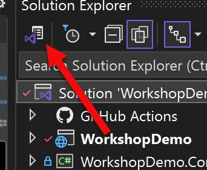
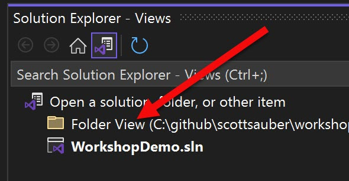
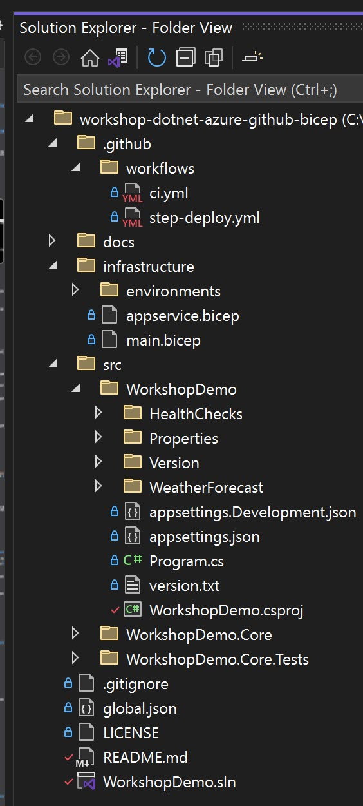
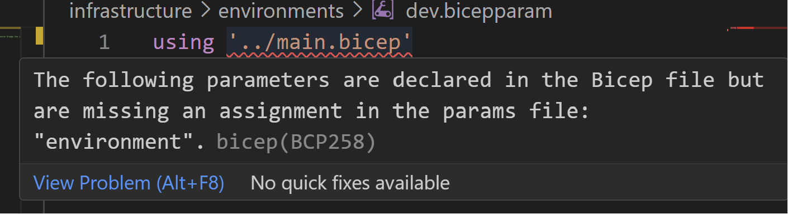
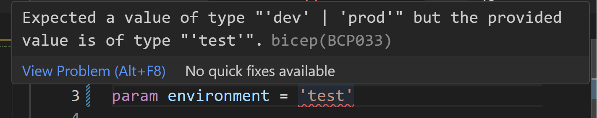
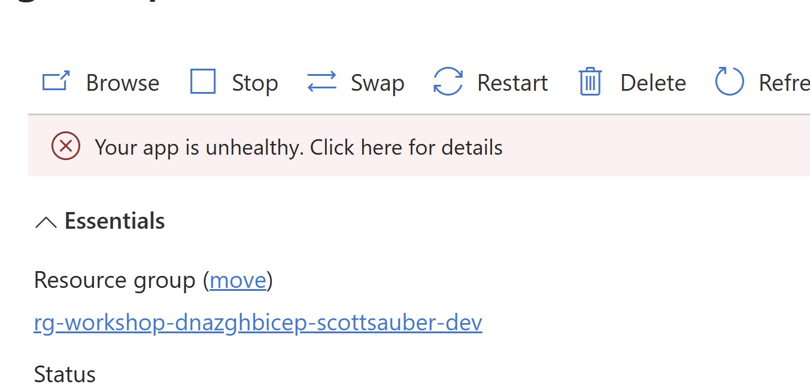
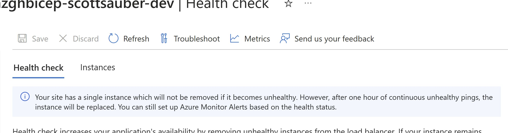
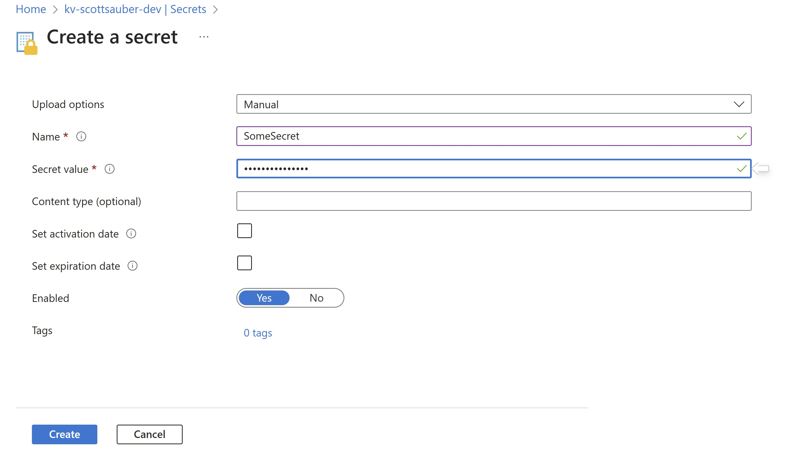

# workshop-dotnet-azure-github-bicep

In this workshop we're going to cover .NET, Azure, GitHub, and Bicep.

This workshop will highlight the following:

- Health Checks
- Zero Downtime Deployments
- Infrastructure managed by code using Bicep
- Automated builds and deploys
- Follows [Azure Naming Standards](https://learn.microsoft.com/en-us/azure/cloud-adoption-framework/ready/azure-best-practices/resource-abbreviations#compute-and-web) for naming resources
- Version Endpoint so you know what's deployed
- Azure Application Insights
- Azure Key Vault

## Workshop

Pre-requisites:

1. [.NET 9](https://dotnet.microsoft.com/en-us/download)
1. Git Knowledge
1. GitHub Account
1. [Azure CLI](https://learn.microsoft.com/en-us/cli/azure/install-azure-cli)
1. Tell Scott the following:
   - Email you will use for Azure
   - GitHub account
   - GitHub repo name
     - Should be the same as this one: workshop-dotnet-azure-github-bicep
1. You will receive two emails, one from Azure to accept being part of the Azure Tenant and another from Scott with some values for you to use later
1. Recommended to use VS Code with the [Bicep extension](https://marketplace.visualstudio.com/items?itemName=ms-azuretools.vscode-bicep) for editing Bicep
1. Fork this repo

## Module 1 - Review Azure Slides

1. What is a Subscription?
2. What is a Resource Group?
3. What is Azure App Service?
4. What is Azure App Service Plan?

## Module 2 - Live Demo of Running Azure App Service

1. Lay of the land
   1. Each of you have 2 Resource Groups for Dev + Prod where you are a Contributor
   2. Each of you have a Federated Credential behind each RG where it's Contributor that's authed to your repo
      1. This is the user Bicep will run under
   3. Each of you have Reader access to two already deployed Dev and Prod Resource Groups with App Services in them so you can follow along
2. View Subscription
   1. View Costs
   2. Set Cost Alerts
   3. Budgets
   4. Access Control (IAM)
   5. Resource Groups
3. View Resource Group
   1. See all resources at a glance
   2. Access Control (IAM)
   3. Deployments
   4. Costs
   5. Go to App Service Plan
4. App Service Plan
   1. Show CPU, Memory, Network
   2. Show RG
   3. Show Scale Up and Scale Out
   4. Show Apps
5. View Home Page of an App Service
   1. Home Page, Stop, Restart
   2. RG + Subscription
   3. Location
   4. Default Domain
   5. OS
   6. Health Check
   7. Show Configuration
   8. Show Custom Domains
   9. Show Certificates
   10. Log Stream
   11. Advanced Tools (Kudu)
       1. Bash Terminal
       2. File System
       3. Logs
   12. Deployment Slots
6. We have the same for each env - Dev and Prod
   1. How do we do that without clicking those same settings everywhere... enter Bicep
7. Show the Version Endpoint
8. Make some change and deploy it, watch it go through the AzurePing service

## Module 3 - Review Bicep Slides

## Module 4 - Bicep Hands On

1. If you're on Visual Studio, consider switching to Folder View so you can see both the /infrastructure folder and the /.github folder

   1. In Solution Explorer click on the "switch between solutions and available views" button

      

   1. Double click on "Folder View"

      

   1. This is what your solution view should now look like

      

1. Delete your `.github` folder and your `infrastructure` folder and commit and push that code. This history is here for reference in case you get stuck.
1. Create a new folder called `infrastructure`
1. Create a `appservice.bicep` file
1. Create a Linux App Service Plan resource

   ```bicep
      resource appServicePlan 'Microsoft.Web/serverfarms@2022-09-01' = {
         name: 'asp-dnazghbicep-'PUTYOURUSERNAMEHERE'-dev'
         location: 'centralus'
         sku: {
           name: 'S1'
         }
         kind: 'linux'
         properties: {
           reserved: true
         }
       }
   ```

1. Next create an App Service resource, by referencing the App Service Plan's ID (note replace the ???? with the reference's ID)

   ```bicep
    resource appService 'Microsoft.Web/sites@2022-09-01' = {
       name: 'app-dnazghbicep-'PUTYOURUSERNAMEHERE'-dev'
       location: 'centralus'
       identity: {
        type: 'SystemAssigned'
       }
       properties: {
          serverFarmId: ????
          httpsOnly: true
          siteConfig: {
            http20Enabled: true
            linuxFxVersion: 'DOTNETCORE|8.0'
            alwaysOn: true
            ftpsState: 'Disabled'
            minTlsVersion: '1.2'
            webSocketsEnabled: true
            healthCheckPath: '/api/healthz'
            requestTracingEnabled: true
            detailedErrorLoggingEnabled: true
            httpLoggingEnabled: true
          }
        }
    }
   ```

1. Add the environment variables for the app service, by referencing the app service object itself (note replace the ???? with the reference)

   ```bicep
       resource appSettings 'Microsoft.Web/sites/config@2022-09-01' = {
         name: 'appsettings'
         kind: 'string'
         parent: appService
         properties: {
             ASPNETCORE_ENVIRONMENT: 'dev'
         }
       }
   ```

1. Add the App Service Slot. Note: there's a lot of duplication in the properties... maybe we should do something about that?

   ```bicep
      resource appServiceSlot 'Microsoft.Web/sites/slots@2022-09-01' = {
         location: 'centralus'
         parent: appService
         name: 'slot'
         identity: {
             type: 'SystemAssigned'
         }
         properties: {
             serverFarmId: appServicePlan.id
             httpsOnly: true
             siteConfig: {
                http20Enabled: true
                linuxFxVersion: 'DOTNETCORE|8.0'
                alwaysOn: true
                ftpsState: 'Disabled'
                minTlsVersion: '1.2'
                webSocketsEnabled: true
                healthCheckPath: '/api/healthz'
                requestTracingEnabled: true
                detailedErrorLoggingEnabled: true
                httpLoggingEnabled: true
             }
         }
      }
   ```

1. Add the environment variables for the app service slot, by referencing the app service object itself (note replace the ???? with the reference)

   ```bicep
    resource appServiceSlotSetting 'Microsoft.Web/sites/slots/config@2022-09-01' = {
      name: 'appsettings'
      kind: 'string'
      parent: appServiceSlot
      properties: {
        ASPNETCORE_ENVIRONMENT: 'dev'
      }
    }
   ```

1. Review the code and identify duplication

1. If you're in VS Code, you're getting a warning for the location not being parameterized. Add a parameter below and then replace all the 'centralus' with a reference to that parameter:

   ```bicep
    param location string

    // replace centralus with location everywhere
   ```

1. If you look closely for duplication you'll see we have "dev" repeated a lot, let's parameterize that too, because we'll want to swap that out for the word "prod" later. Also restrict the values to only allow 'dev' and 'prod'.

   ```bicep
     @allowed(['dev', 'prod'])
     param environment string

     // replace dev with environment everywhere. Note: ${variableName} is how you do concatenation
   ```

1. If you look closely for more duplication, you'll see we have the app name repeated in both the appService and appServicePlan. Extract that out to a parameter

   ```bicep
    param appName string

    // down in the appServicePlan replace the name so it looks like this:
    resource appServicePlan 'Microsoft.Web/serverfarms@2022-09-01' = {
      name: 'asp-${appName}'
      // the rest
    }

    // down in the appService replace the name so it looks like this:
    resource appService 'Microsoft.Web/sites@2022-09-01' = {
      name: 'app-${appName}'
      // the rest
    }
   ```

1. Finally, if you look closely you'll see one last bit of duplication. The properties between the appService and the appServiceSlot. Let's extract out those properties to a variable and assign it in one place

   ```bicep
      // This is reused between the App Service and the Slot
      var appServiceProperties = {
          serverFarmId: appServicePlan.id
          httpsOnly: true
          siteConfig: {
            http20Enabled: true
            linuxFxVersion: 'DOTNETCORE|8.0'
            alwaysOn: true
            ftpsState: 'Disabled'
            minTlsVersion: '1.2'
            webSocketsEnabled: true
            healthCheckPath: '/api/healthz'
            requestTracingEnabled: true
            detailedErrorLoggingEnabled: true
            httpLoggingEnabled: true
          }
      }

      // Assign it in the appService and the appServiceSlot
      resource appService 'Microsoft.Web/sites@2022-09-01' = {
         // the rest
         properties: appServiceProperties
      }

      resource appServiceSlot 'Microsoft.Web/sites/slots@2022-09-01' = {
         // the rest
         properties: appServiceProperties
      }
   ```

1. Awesome! We now have a reusable Module that also enforces our naming standards that follow the [Azure Guidelines](https://learn.microsoft.com/en-us/azure/cloud-adoption-framework/ready/azure-best-practices/resource-abbreviations#compute-and-web) with the `asp-` prefix for App Service plans and `app-` for App Services.

1. Now we need to pass some values to those parameters. So let's create a `main.bicep` file under the `infrastructure` folder

1. Provide a `targetScope` of 'resourceGroup' for the `main.bicep` module

   ```bicep
    targetScope = 'resourceGroup'
   ```

1. Now reference the `appservice.bicep` module you just created and pass the parameters to it

   ```bicep
    module appService './appservice.bicep' = {
      name: 'appservice'
      params: {
        appName: 'workshop-dnazghbicep-'YOURUSERNAMEHERE''
        environment: ???
        location: 'centralus'
      }
    }
   ```

1. Crap - where does the environment come from? I want to pass that in dynamically depending on dev or prod. Enter `.bicepparam` files (these will be passed in dynamically via the CLI)

1. Add a parameter for environment and only allow `'dev'` and `'prod'` as values then reference that environment below in the `app` module

   ```bicep
    @allowed(['dev', 'prod'])
    param environment string

    targetScope = 'resourceGroup'

    module appService './appservice.bicep' = {
      name: 'appservice'
      params: {
        appName: 'workshop-dnazghbicep-'YOURUSERNAMEHERE''
        environment: environment
        location: 'centralus'
      }
    }

   ```

1. Under the `infrastructure` folder, create a folder called `environments`.

1. Create a `dev.bicepparam` file with the following contents

   ```bicep
     using '../main.bicep'

     param environment = 'dev'
   ```

1. The `using` tells the `bicepparam` file what parameters are required. Try taking away the `param environment = 'dev'` and see what happens if you're in VS Code with the Bicep Extension. You will receive an error.

   

1. Now add back `param environment ='dev'` but switch `'dev'` to `'qa'` or some other invalid value. You will see an error like this if you use VS Code.

   

1. Now make a `prod.bicepparam` similar to your `dev.bicepparam` but with a value of `prod` instead of `dev`.

1. That's it! We now have Bicep ready to be configured... but crap... how do we deploy it?? 👇👇

## Module 5 - GitHub Actions Review Slides

## Module 6 - GitHub Actions Hands On

1. If it doesn't already exist, create a folder called `.github` and then `workflows` under that folder.
1. Create 6 new secrets based on the email you received at the beginning of this workshop. These secrets will be used to authenticate to Azure. If this wasn't in place, you wouldn't be able to talk to your Azure account, because Azure doesn't just let anyone in.
   1. Go to your Repo out in GitHub
   1. Click on Settings
   1. Click on Secrets and Variables
   1. Click on Actions
   1. Click New Repository Secret
   1. For secret name type `DEV_AZURE_CLIENT_ID`
   1. For the value paste in the value from the Dev value in the email
   1. Hit Add Secret
   1. Repeat for `DEV_AZURE_SUBSCRIPTION_ID` and `DEV_AZURE_TENANT_ID`
   1. Repeat for the Prod values for `PROD_AZURE_CLIENT_ID`, `PROD_AZURE_SUBSCRIPTION_ID`, and `PROD_AZURE_TENANT_ID`
   1. Note - the Subscription ID and the Tenant ID are the same. That is just for Workshop demo purposes. In a real world scenario the Subscription ID should be different.
1. Create a `ci.yml` file that looks like this. Note to replace the "<YOURUSERNAMEHERE>" with your GH username

   ```yml
   name: CI - Deploy App and Bicep

   on:
     push:
       branches: [main]
     workflow_dispatch:

   permissions:
     id-token: write
     pull-requests: write
     contents: read

   jobs:
     build_and_test:
       runs-on: ubuntu-latest
       name: Build, Test, Upload Artifact

       steps:
         - name: Checkout repo
           uses: actions/checkout@v1

         - name: Run dotnet test
           run: |
             dotnet test -c Release

         - name: Run dotnet publish
           run: |
             dotnet publish ./src/WorkshopDemo/WorkshopDemo.csproj -c Release -o ./publish

         - name: Update version file with GHA run number and git short SHA
           run: echo $(date +'%Y%m%d.%H%M').${{github.run_number}}-$(git rev-parse --short HEAD) > publish/version.txt

         - name: Upload artifact
           uses: actions/upload-artifact@v3
           with:
             name: dotnet-artifact
             path: publish/

     dev:
       needs: build_and_test
       uses: ./.github/workflows/step-deploy.yml
       with:
         env: dev
         artifact_name: dotnet-artifact
         resource_group_name: rg-workshop-dnazghbicep-<YOURUSERNAMEHERE>-dev
         app_service_name: app-workshop-dnazghbicep-<YOURUSERNAMEHERE>-dev
         app_service_slot_name: slot
       # Note: use GH Environment Secrets if using a Pro/Enterprise version of GH
       secrets:
         azure_client_id: ${{ secrets.DEV_AZURE_CLIENT_ID }}
         azure_subscription_id: ${{ secrets.DEV_AZURE_SUBSCRIPTION_ID }}
         azure_tenant_id: ${{ secrets.DEV_AZURE_TENANT_ID }}

     prod:
       needs: dev
       uses: ./.github/workflows/step-deploy.yml
       with:
         env: prod
         artifact_name: dotnet-artifact
         resource_group_name: rg-workshop-dnazghbicep-<YOURUSERNAMEHERE>-prod
         app_service_name: app-workshop-dnazghbicep-<YOURUSERNAMEHERE>-prod
         app_service_slot_name: slot
       # Note: use GH Environment Secrets if using a Pro/Enterprise version of GH
       secrets:
         azure_client_id: ${{ secrets.PROD_AZURE_CLIENT_ID }}
         azure_subscription_id: ${{ secrets.PROD_AZURE_SUBSCRIPTION_ID }}
         azure_tenant_id: ${{ secrets.PROD_AZURE_TENANT_ID }}
   ```

1. Note the `needs` in this workflow where the `dev` job needs `build_and_test` and the `prod` job needs `dev`. That indicates the jobs should be ran sequentially and not in parallel. Specifically in the order of `build_and_test` => `dev` => `prod`
1. We now need to create the reusable step in the `step-deploy.yml` to reduce duplication. Create a `step-deploy.yml` under the `.github/workflows` folder and enter in this data:

   ```yml
   name: "Step - Deploy"

   on:
     workflow_call:
       inputs:
         env:
           required: true
           type: string
         artifact_name:
           required: true
           type: string
         resource_group_name:
           required: true
           type: string
         app_service_name:
           required: true
           type: string
         app_service_slot_name:
           required: true
           type: string
       secrets:
         azure_client_id:
           required: true
           description: "Client ID for Azure Service Principal"
         azure_subscription_id:
           required: true
           description: "Azure Subscription ID for the targeted Resource Group"
         azure_tenant_id:
           required: true
           description: "Azure Tenant ID for the targeted Resource Group"

   jobs:
     deploy:
       name: Deploy to Azure
       runs-on: ubuntu-latest

       concurrency:
         group: deploy-to-azure
         cancel-in-progress: false

       steps:
         - uses: actions/checkout@v3

         - name: Log in to Azure
           uses: azure/login@v1
           with:
             client-id: ${{ secrets.azure_client_id }}
             tenant-id: ${{ secrets.azure_tenant_id }}
             subscription-id: ${{ secrets.azure_subscription_id }}

         - name: Run Bicep
           run: |
             az deployment group create \
               --name ${{ inputs.env }}-deployment-${{ github.run_number }} \
               --template-file infrastructure/main.bicep \
               --parameters infrastructure/environments/${{ inputs.env }}.bicepparam \
               --resource-group ${{ inputs.resource_group_name }} \
               --verbose

         - uses: actions/download-artifact@v3
           with:
             name: ${{ inputs.artifact_name }}
             path: publish

         - name: Get publish profile
           id: publishprofile
           run: |
             profile=$(az webapp deployment list-publishing-profiles --resource-group ${{ inputs.resource_group_name }} --name ${{ inputs.app_service_name }} --slot ${{ inputs.app_service_slot_name }} --xml)
             echo "PUBLISH_PROFILE=$profile" >> $GITHUB_OUTPUT

         - name: Deploy to Slot
           uses: azure/webapps-deploy@v2
           with:
             app-name: ${{ inputs.app_service_name }}
             slot-name: ${{ inputs.app_service_slot_name }}
             publish-profile: ${{ steps.publishprofile.outputs.PUBLISH_PROFILE }}
             package: publish/

         - name: Swap slots
           run: |
             az webapp deployment slot swap -g ${{ inputs.resource_group_name }} -n ${{ inputs.app_service_name }} --slot ${{ inputs.app_service_slot_name }} --target-slot production --verbose
   ```

1. Go to GitHub under `Actions` and hit Accept to run workflows on your Forked Repository

1. Commit and push! When you commit and push this code with both the action and the pipeline, your Action will trigger immediately. Go to the Actions tab in GitHub and follow its progress from Dev all the way to Production

   > Note if you get an error like: The client '<xxx>' with object id '<xxx>' does not have authorization to perform action 'Microsoft.Resources/deployments/validate/action' over scope '/subscriptions/\*\*\*/resourcegroups/rg-workshop-dnazghbicep-<yourghusername>-dev/providers/Microsoft.Resources/deployments/dev-deployment-37' or the scope is invalid. If access was recently granted, please refresh your credentials.

   > This means you need to give your GitHub username and email to Scott, because he needs to do some magic to auth you to the pipeline.

1. Go to your Dev App Service Plan and note that the SKU is an S1. Let's change that to an S2 and commit and push that.

1. Go to your `WeatherForecastController` and get rid of all the `summaries` except `Freezing`. Then commit and push and watch it deploy.

1. Go to your Dev App Service Slot /api/WeatherForecast URL and note that it is still changing the summaries. Whereas the main App Service /api/WeatherForecast URL is ha

1. Take note of the /api/version endpoint and then correlate that back to the Git SHA back in GitHub. Note how in `ci.yml` we are setting that version and putting it in `version.txt` file that gets read by the application.

## Module 7 - Health Check Slides

## Module 8 - Health Check Hands On

1. Open the `WorkshopDemoHealthCheck` under the `WorkshopDemo` project and `/HealthChecks`. Take note that this is just returning that the app is healthy. While this may not seem super useful, it actually is much better than nothing. This ensures that the application booted and didn't crash while trying to execute `Program.cs`.

1. Open your `appservice.bicep` file under the `infrastructure` folder and find the `healthCheckPath`. You'll see that it's wired up to a `/api/healthz` endpoint. This is configured in `Program.cs` via `app.MapHealthChecks("/api/healthz")`.

1. Now that we know how it all works together, let's make this health check fail and see how Azure App Service responds.

1. Change the `WorkshopDemoHealthCheck` from `return Task.FromResult(HealthCheckResult.Healthy("A healthy result."));` to `return Task.FromResult(HealthCheckResult.Unhealthy("A failure occurred."));` to simulate the app being unhealthy.

1. Commit and push this change and then go to your App Service in the Portal and see what happens

1. What should happen is it will succeed to deploy, but it will say your app is unhealthy and warn you it will replace the instance after an hour of unhealthy checks. If you had multiple instances and one reported unhealthy and the other was healthy, it'd route to the healthy one automagically.

   

1. Then after clicking on that "Click here" you will see this:

   

1. Revert your change back to returning a `Healthy` result and commit and push that change.

## Module 9 - Azure Key Vault Review Slides

## Module 10 - Azure Key Vault Hands On

1. Normally you would install the `Azure.Extensions.AspNetCore.Configuration.Secrets` and `Azure.Identity` packages into your project but this has already been done for you.

1. Go to the `Program.cs` file in the `WorkshopDemo` project

1. Add the using `using Azure.Identity;` to the top of the file

1. Add the following code:

   ```csharp
       builder.Configuration.AddAzureKeyVault(
           new Uri($"https://kv-{yourName}-{builder.Environment.EnvironmentName}.vault.azure.net/"),
           new DefaultAzureCredential());
   ```

1. Note: the above code will not compile, replace `{yourName}` with your actual name. So for me (Scott Sauber) it might look like:

   ```csharp
       builder.Configuration.AddAzureKeyVault(
           new Uri($"https://kv-scottsauber-{builder.Environment.EnvironmentName}.vault.azure.net/"),
           new DefaultAzureCredential());
   ```

1. Next you will need to do an `az login` using the Azure CLI to login to Azure. Otherwise you'll get a massive error when you try to run the app that starts with below:

   > Unhandled exception. Azure.Identity.CredentialUnavailableException: DefaultAzureCredential failed to retrieve a token from the included credentials.

1. Run your application

1. It will fail, because the Key Vault doesn't exist in Bicep yet.

1. Add the following Bicep in a `keyvault.bicep` file in the `infrastructure` folder. Note - replace the "PUTYOURUSEROBJECTIDFROMYOUREMAILHERE" with the Azure User's Object ID listed in the bottom of the email you received.

   ```bicep
       param appId string
       param slotId string
       param location string
       param appName string

       resource keyVault 'Microsoft.KeyVault/vaults@2022-07-01' = {
         name: 'kv-${appName}'
         location: location
         properties: {
           tenantId: subscription().tenantId
           sku: {
             family: 'A'
             name: 'standard'
           }
           accessPolicies: [
             // AppService
             {
               tenantId: subscription().tenantId
               objectId: appId
               permissions: {
                 keys: [
                   'get'
                   'list'
                   'unwrapKey'
                   'wrapKey'
                 ]
                 secrets: [
                   'get'
                   'list'
                 ]
                 certificates: []
               }
             }
             // AppService Slot
             {
               tenantId: subscription().tenantId
               objectId: slotId
               permissions: {
                 keys: [
                   'get'
                   'list'
                   'unwrapKey'
                   'wrapKey'
                 ]
                 secrets: [
                   'get'
                   'list'
                 ]
                 certificates: []
               }
             }
             // Myself - normally you wouldn't put a user here, you'd use a Group all the developers are in
             {
               tenantId: subscription().tenantId
               objectId: PUTYOURUSEROBJECTIDFROMYOUREMAILHERE
               permissions: {
                   keys: [
                       'get'
                       'list'
                       'update'
                       'create'
                       'import'
                       'delete'
                       'recover'
                       'backup'
                       'restore'
                       'decrypt'
                       'encrypt'
                       'unwrapKey'
                       'wrapKey'
                       'verify'
                       'sign'
                       'purge'
                   ]
                   secrets: [
                       'get'
                       'list'
                       'set'
                       'delete'
                       'recover'
                       'backup'
                       'restore'
                       'purge'
                   ]
                   certificates: [
                       'get'
                       'list'
                       'update'
                       'create'
                       'import'
                       'delete'
                       'recover'
                       'backup'
                       'restore'
                       'manageContacts'
                       'manageIssuers'
                       'getIssuers'
                       'listIssuers'
                       'setIssuers'
                       'deleteIssuers'
                       'purge'
                   ]
               }
             }
           ]
         }
       }

       output keyVaultName string = keyVault.name

   ```

1. We pass in the App ID and Slot ID. These reference the App Service Object ID and the App Service Slot Object ID. This allows the App Service and the Slot to talk to this Key Vault. But how do we get those Object IDs? Those are randomly generated when it creates the App Service. We basically need to pass data from the App Service module to the Key Vault module. Outputs to the rescue!

1. In the `appservice.bicep` file add the following at the bottom. Outputs are kind of like `return` statements in C#

   ```bicep
       output appServiceInfo object = {
         appId: appService.identity.principalId
         slotId: appServiceSlot.identity.principalId
       }
   ```

1. In your `main.bicep` file, add the following code to wire up the Key Vault module to your deployment.

   ```bicep
       module keyvault './keyvault.bicep' = {
         name: 'keyvault'
         params: {
           appId: appService.outputs.appServiceInfo.appId
           slotId: appService.outputs.appServiceInfo.slotId
           location: location
           appName: '${myName}-${environment}' // key vault has 24 char max so just doing your name, usually would do appname-env but that'll conflict for everyone
         }
       }
   ```

1. Note that the `appService` reference is referencing the `module` above and then you can access the `outputs`. Again, outputs are kind of like a `return` statement.

1. Also note - there's a refactor done here with `myName`, that is a variable that references your GitHub name. Look at your result and check where else could that be used? Spoiler: check the next step

1. The final `main.bicep` should look like this

   ```bicep
       @allowed(['dev', 'prod'])
       param environment string

       var location = 'centralus'
       var myName = 'scottsauber'
       var appNameWithEnvironment = 'workshop-dnazghbicep-${myName}-${environment}'

       targetScope = 'resourceGroup'

       module appService './appservice.bicep' = {
         name: 'appservice'
         params: {
           appName: appNameWithEnvironment
           environment: environment
           location: location
         }
       }

       module keyvault './keyvault.bicep' = {
         name: 'keyvault'
         params: {
           appId: appService.outputs.appServiceInfo.appId
           slotId: appService.outputs.appServiceInfo.slotId
           location: location
           appName: '${myName}-${environment}' // key vault has 24 char max so just doing your name, usually would do appname-env but that'll conflict for everyone
         }
       }
   ```

1. Commit and push

1. Go to your Resource Group in Azure and watch the Key Vault get added as your GitHub Action runs.

1. After your Key Vault is created, run your app again and it will succeed.

1. Add a Secret to your Azure Key Vault. Go to your Key Vault, then Secrets, then click "Generate/Import". For Upload Options select Manual, Name call it "SomeSecret," give it a value of your choice, make sure activation date is unchecked, expiration date is unchecked, Enabled is On, and no tags. It should look like this:

   

1. Click Create

1. Now that we have a Secret in Key Vault, let's read from it in your app.

1. After your `AddAzureKeyVault` call in Program.cs... let's write out the secret to the command line. Obviously normally you wouldn't do this, but this is just to illustrate that the value is there.

   ```csharp
     Console.WriteLine($"My secret value is: {builder.Configuration.GetValue<string>("SomeSecret")}");
   ```

1. Now run your app. View the terminal that is launched and view your secret value. Feel free to change it and restart your application to see the new value applied.

   > Note - by default `AddAzureKeyVault` does NOT hot reload your secrets when they change. You will have to restart your application in order to see this. Azure App Service has a "Restart" functionality in the portal on the Overview tab, or re-deploy would cause a restart as well. This is usually fine for most scenarios, but if you have a situation where your secrets are changing very often - you can configure Azure Key Vault to poll by using an overload on `AddAzureKeyVault` to pass in a `AzureKeyVaultConfigurationOptions` with a `ReloadInterval` property set, but do note this means you will get charged much more often.

1. Our secret assumes it's at the root of Configuration, but sometimes you want to nest secrets together at a different Parent/Child relationship. A common scenario for this is connection strings. By default ASP.NET Core encourages your connection strings to look something like this in our `appsettings.json` file:

   ```json
   {
     "ConnectionStrings": {
       "MyApplication": "ConnectionStringValueHere"
     }
   }
   ```

1. But how do we do that in Azure Key Vault when our Secrets are just key value pairs and not objects? The answer is using a delimiter of `--`.

1. Create a new Key Vault secret called `ConnectionStrings--MyApplication` and add some random value in there and save it. Then go back to your `Program.cs` after your `.AddAzureKeyVault` call and add the following:

   ```csharp
    Console.WriteLine($"My connection string value is: {builder.Configuration.GetConnectionString("MyApplication")}");
   ```

1. Re-run your application and note your value shows up.

## Module 11 - Log Analytics Slides

## Module 12 - Application Insights Slides

## Module 13 - Application Insights Hands On

1. Create a `monitor.bicep` file in your `/infrastructure` folder.

1. Add the following Bicep to that `monitor.bicep` file:

   ```bicep
       param location string
       param appName string
       param keyVaultName string

       resource logWs 'Microsoft.OperationalInsights/workspaces@2022-10-01' = {
         name: 'law-${appName}'
         location: location
       }

       resource applicationInsights 'Microsoft.Insights/components@2020-02-02' = {
         name: 'ai-${appName}'
         location: location
         kind: 'web'
         properties: {
           Application_Type: 'web'
           WorkspaceResourceId: logWs.id
         }
       }

       resource keyVault 'Microsoft.KeyVault/vaults@2022-07-01' existing = {
         name: keyVaultName
       }

       resource aiSecret 'Microsoft.KeyVault/vaults/secrets@2023-02-01' = {
         name: 'ConnectionStrings--ApplicationInsights'
         parent: keyVault
         properties: {
           value: applicationInsights.properties.ConnectionString
         }
       }
   ```

1. This will setup both the Azure Log Analytics Workspace, as well as Application Insights. As well as add a Secrets for Application Insights into your Key Vault. That way you don't have to add it later for each environment.

1. Add to your `main.bicep` to wire up the `monitor` module.

   ```bicep
       module monitor './monitor.bicep' = {
         name: 'monitor'
         params: {
           appName: appNameWithEnvironment
           keyVaultName: keyvault.outputs.keyVaultName
           location: location
         }
       }
   ```

1. Commit and push that and now let's wire up our .NET code to this

1. Normally you'd install the following packages, but they've already been installed for you:

   1. Microsoft.ApplicationInsights
   1. Microsoft.ApplicationInsights.AspNetCore
   1. Serilog
   1. Serilog.AspNetCore
   1. Serilog.Sinks.ApplicationInsights

1. Add the following code to your `Program.cs` to enable Application Insights (note: this will not pull telemetry until you deploy)

   ```csharp
       builder.Services.AddApplicationInsightsTelemetry(options =>
       {
           options.ConnectionString = builder.Configuration.GetConnectionString("ApplicationInsights");
       });
   ```

1. Add the following code to your `Program.cs` to enable Log Analytics via Application Insights (AI is built on LA).

   ```csharp
       var builder = WebApplication.CreateBuilder(args);

       Log.Logger = new LoggerConfiguration()
           .MinimumLevel.Debug()
           .Enrich.FromLogContext()
           .WriteTo.Console()
           .CreateBootstrapLogger();
   ```

1. This sets up the Serilog Bootstrap Logger in case something goes wrong prior to Logging being configured. Next wrap the rest of your code in a `try/catch/finally` and inside the `try` add the following:

   ```csharp
               try
       {
           Log.Information("Starting web host");

           // Add services to the container.
           builder.Host.UseSerilog((ctx, lc) => lc
               .MinimumLevel.Information()
               .MinimumLevel.Override("WorkshopDemo", LogEventLevel.Debug)
               .MinimumLevel.Override("System", LogEventLevel.Error)
               .WriteTo.Console(
                   outputTemplate:
                   "[{Timestamp:HH:mm:ss} {Level}] {SourceContext}{NewLine}{Message:lj}{NewLine}{Exception}{NewLine}",
                   theme: AnsiConsoleTheme.Literate)
               .WriteTo.ApplicationInsights(
                   new TelemetryConfiguration
                       { ConnectionString = ctx.Configuration.GetConnectionString("ApplicationInsights") },
                   TelemetryConverter.Traces)
               .Enrich.FromLogContext());

            // Other registrations...
            // ...

            builder.Services.AddApplicationInsightsTelemetry(options =>
            {
                options.ConnectionString = builder.Configuration.GetConnectionString("ApplicationInsights");
            });
       }
       catch (Exception ex)
       {
           Log.Fatal(ex, "Application terminated");
       }
       finally
       {
           Log.CloseAndFlush();
       }
   ```

1. If you would like, you could add an `app.UseSerilogRequestLogging` right after `var app = builder.Build()`. This will log out to Log Analytics useful info like the URL and how long it took for each request.

1. The final output should look something like this below

   ```csharp
        try
        {
            Log.Information("Starting web host");

            // Add services to the container.
            builder.Host.UseSerilog((ctx, lc) => lc
                .MinimumLevel.Information()
                .MinimumLevel.Override("WorkshopDemo", LogEventLevel.Debug)
                .MinimumLevel.Override("System", LogEventLevel.Error)
                .WriteTo.Console(
                    outputTemplate:
                    "[{Timestamp:HH:mm:ss} {Level}] {SourceContext}{NewLine}{Message:lj}{NewLine}{Exception}{NewLine}",
                    theme: AnsiConsoleTheme.Literate)
                .WriteTo.ApplicationInsights(
                    new TelemetryConfiguration
                        { ConnectionString = ctx.Configuration.GetConnectionString("ApplicationInsights") },
                    TelemetryConverter.Traces)
                .Enrich.FromLogContext());

            builder.Services.AddEndpointsApiExplorer();
            builder.Services.AddOpenApi();
            builder.Services.AddControllers();
            builder.Services.AddHealthChecks()
                .AddCheck<WorkshopDemoHealthCheck>(nameof(WorkshopDemoHealthCheck));
            builder.Services.AddSingleton<IFileService, FileService>();
            builder.Services.AddSingleton<IVersionService, VersionService>();

            builder.Configuration.AddAzureKeyVault(
                new Uri($"https://kv-{YOURNAMEHERE}-{builder.Environment.EnvironmentName}.vault.azure.net/"),
                new ChainedTokenCredential(new AzureCliCredential(), new ManagedIdentityCredential()));

            builder.Services.AddApplicationInsightsTelemetry(options =>
            {
                options.ConnectionString = builder.Configuration.GetConnectionString("ApplicationInsights");
            });

            var app = builder.Build();

            app.UseSerilogRequestLogging();

            // Configure the HTTP request pipeline.
            if (app.Environment.IsDevelopment())
            {
                app.MapOpenApi();
            }

            app.UseHttpsRedirection();

            app.MapHealthChecks("/api/healthz");

            app.MapControllers();

            app.Run();
        }
        catch (Exception ex)
        {
            Log.Fatal(ex, "Application terminated");
        }
        finally
        {
            Log.CloseAndFlush();
        }
   ```

1. Commit and push and then trigger some requests on your App Service to the /api/weatherforecast and /api/weatherforecast/slow and look at the logs and the app insights information.
